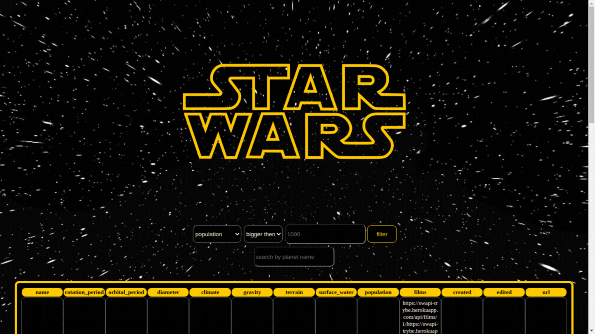

# Project StarWars Planets Search! 🔭​

This React application receives from an API a list with data of planets from the Star Wars universe, there are also filters where it is possible:
  * search for a planet by name;
  * filter planets by specific features



---

## About the project
This project was developed with a focus on learning how to use Context API and Hooks in a React application as a state manipulation tool. 

---

## Technologies used
  * HTML
  * CSS
  * JavaScript
  * React.js
  * Context API
  * React Hooks

---

## How to run the project
Application Deployment is available at [here](https://star-wars-planets-search-alinecarolina.vercel.app/) but if you want, here are the instructions 

```
$ git clone git@github.com:AlineCarolina/StarWars-Planets-Search.git
```
Enter the repository folder you just cloned:
```
$ cd StarWars-Planets-Search
```
Install the dependencies:
```
$ npm install
```
And start the project:
```
$ npm start
```

---
